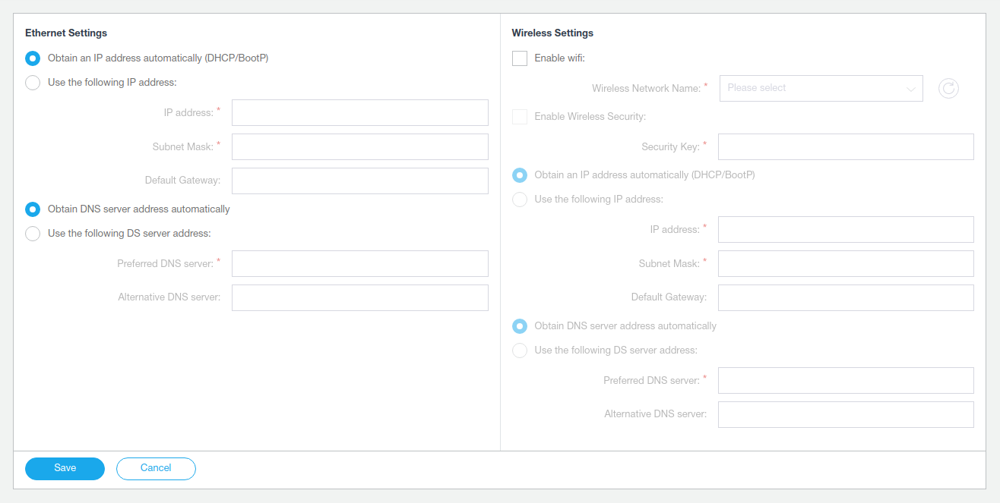
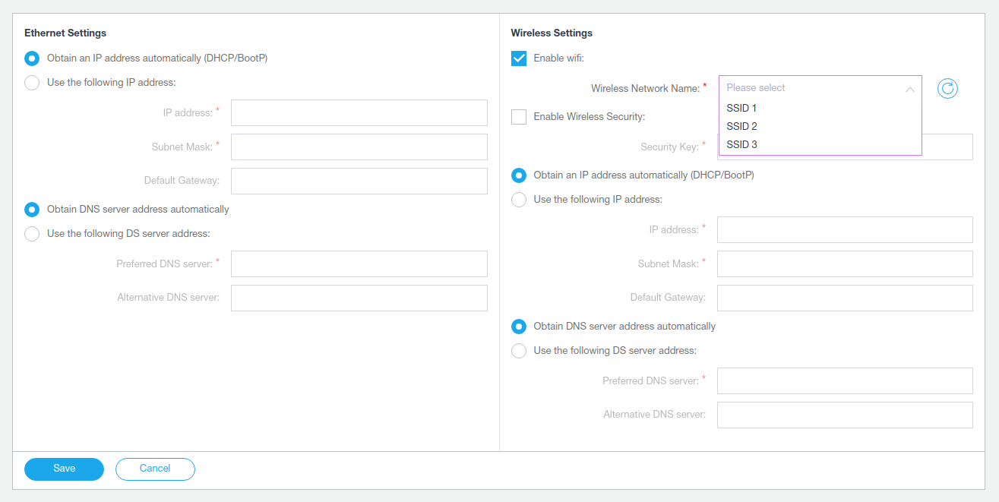

# Technical task

A technical task from "Labinvent" JSC.

## Description

When user opens `index.html` he should see network settings page. Fields contains last saved data.

All form fields for text input. The exclude is **"Wireless Network Name"** field, that should be drop-down menu type.

Fields marked as an asterisk should be mandatory if them were activated user.

Radio-buttons in state **"Obtain an IP address automatically"** and **"Obtain DNS server address automatically"** do fields group 
not available and disable a validation for them.

Checkbox **"Enable wifi"** do fields wifi settings available in state `true`.

Checkbox **"Enable Wireless Security"** make a field  **"Security Key"** available in state `true`.

Field **"Wireless Network Name"** view list all available access points.
All points should be a sorted by *__strength__*. Access points with *__favorite__* - `true`, should show in top of list.
By press **"&#x21bb;"** button sending new request to get access points.

By press **"Save"** button specified configuration should was validate and send to server.

## Stack

**You should use:**
* angular2+ or react for client
* node.js for server

**Optionally:**
* mongodb to keep saved configurations
